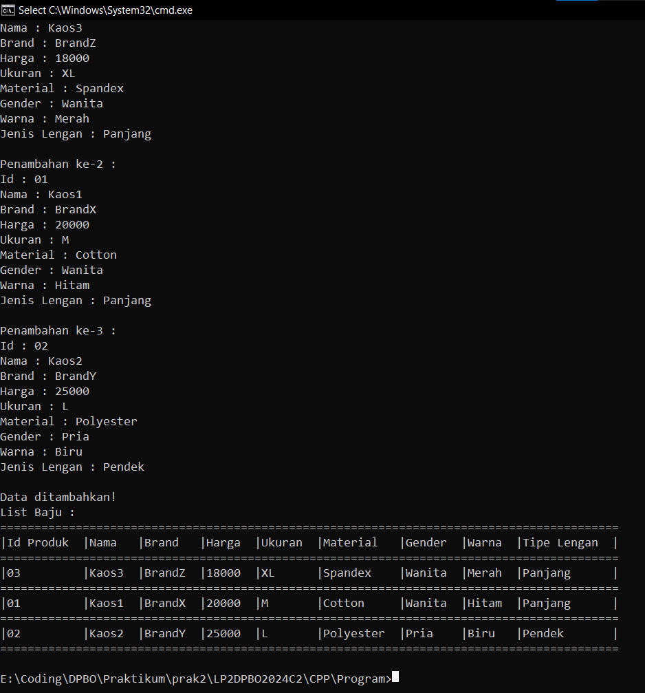
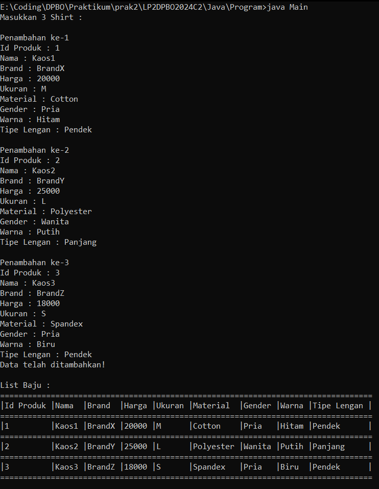
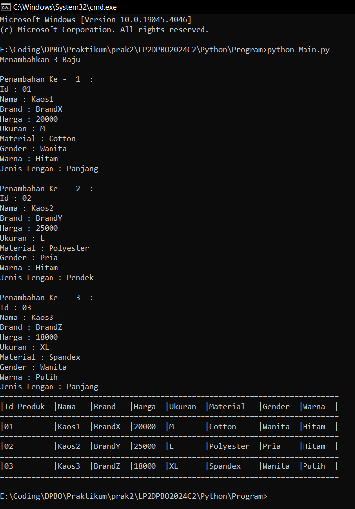
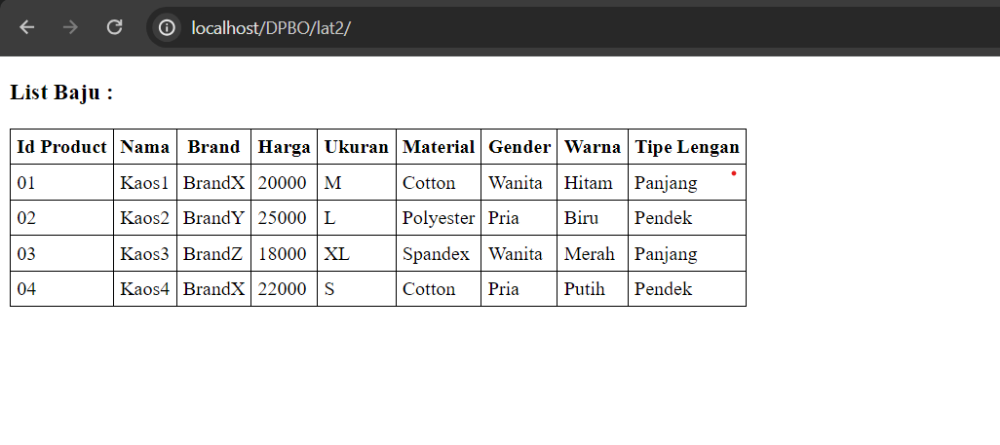

# LP2DPBO2024C2

## Janji
Saya Muhamad Tio Ariyanto [2201718] mengerjakan soal Latihan Praktikum 2
dalam mata kuliah DPBO untuk keberkahanNya saya tidak melakukan kecurangan
seperti yang telah dispesifikasikan. Aamiin

## Desain Program

## Penjelasan Desain Program
**1. Kelas Product**

Kelas Product adalah kelas utama yang menjadi induk dari kelas Clothing dan Shirt. Hal ini disebabkan karena Clothing dapat dikategorikan sebagai produk dan Shirt dapat dikategorikan sebagai Clothing. Selain itu, setiap atribut yang dimiliki oleh Product juga dapat digunakan oleh Clothing dan Shirt. Kelas Product memiliki empat atribut, yaitu idProduct, name, brand, dan price. Setiap atribut bersifat privat dan memiliki metode get dan set yang bersifat publik agar dapat diakses oleh kelas lain.

**2. Kelas Clothing**

Kelas Clothing merupakan turunan dari kelas Product dan merupakan induk dari kelas Shirt. Kelas Clothing dapat menggunakan atribut dari kelas Product, dan setiap atribut yang dimiliki oleh kelas Clothing dapat digunakan oleh kelas Shirt. Kelas Clothing memiliki tiga atribut, yaitu size, material, dan gender. Setiap atribut bersifat privat dan memiliki metode get dan set yang bersifat publik agar dapat diakses oleh kelas lain.

**3. Kelas Clothing**

Kelas Shirt merupakan turunan dari kelas Clothing dan cucu dari kelas Product. Kelas Shirt dapat menggunakan semua atribut yang dimiliki oleh kelas Product dan kelas Clothing. Kelas Shirt memiliki dua atribut, yaitu color dan sleeve_type. Setiap atribut bersifat privat dan memiliki metode get dan set yang bersifat publik agar dapat diakses oleh kelas lain.

**4. Kelas Tabel**

Kelas Tabel adalah kelas mandiri yang tidak mewarisi atau diwarisi oleh kelas lain. Hal ini disebabkan karena atribut yang dimiliki oleh kelas lain tidak dapat atau tidak cocok digunakan oleh kelas Tabel. Kelas Tabel memiliki dua atribut, yaitu baris dan kolom. Setiap atribut bersifat privat. Adapun method yang digunakan yaitu method setter dan getter serta method untuk pembuatan baris dari tabel itu sendiri.

Dalam program ini, hanya dapat menambahkan data. Setelah memasukkan data, program akan menampilkan tabel yang berisi data yang dimasukkan.

## Dokumentasi
### Dokumentasi CPP

### Dokumentasi Java

### Dokumentasi Python

### Dokumentasi PHP

